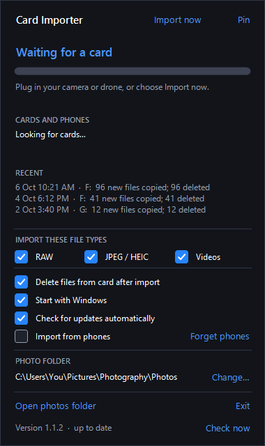

<p align="center">
  
</p>

<p align="center">
  <a href="https://github.com/ImSammyTTV/lightroom-card-importer/releases/latest"></a>
  <a href="https://github.com/ImSammyTTV/lightroom-card-importer/actions/workflows/build.yml"></a>
  
  
  <a href="LICENSE"></a>
</p>

<p align="center">
  <b>Card Importer</b> moves photos and videos from your camera or drone card<br>
  into Lightroom Classic, sorted into date folders and checked for errors.
</p>

<p align="center">
  <a href="https://github.com/ImSammyTTV/lightroom-card-importer/releases/latest"><b>⬇️ Download</b></a> ·
  <a href="#-quick-start"><b>🚀 Quick start</b></a> ·
  <a href="#-windows"> <b>Windows</b></a> ·
  <a href="#-mac"> <b>Mac</b></a> ·
  <a href="#-lightroom-plugin"><b>🔌 Plugin</b></a> ·
  <a href="#-help"><b>❓ Help</b></a> ·
  <a href="https://github.com/ImSammyTTV/lightroom-card-importer/issues/new"><b>🐛 Report a bug</b></a>
</p>

---

## ✨ Features

<table>
<tr>
<td width="50%" valign="top">

### 📥 Plug in and done
Insert a card, or connect the camera or drone in USB mass-storage mode. New files are copied straight away.
Works with a Sony a7 IV, a DJI Mini 5 Pro, or anything with a `DCIM` folder.

</td>
<td width="50%" valign="top">

### 🗂️ Date folders
Files go into `Photos/2026/2026-10-06/` by capture date, the layout Lightroom's own Auto Import can't do.

</td>
</tr>
<tr>
<td valign="top">

### ✅ Every copy is checked
Each file is hashed while it is read, then the copy is read back and compared (SHA-256). A copy that doesn't match
is thrown away, never kept.

</td>
<td valign="top">

### 🧹 Clears the card, safely
Optionally deletes from the card, but **only files it has proven are in your library** with an identical hash.
If anything fails, the card is left alone.

</td>
</tr>
<tr>
<td valign="top">

### 🔁 No duplicates
Skips files already in your library (even renamed ones) and files it has copied before, so plugging the same
card in twice does nothing.

</td>
<td valign="top">

### 🔌 Straight into Lightroom
A small plugin adds the new files to your catalog in place, about once a minute while Lightroom is open.

</td>
</tr>
<tr>
<td valign="top">

### 🎞️ Choose what to import
Switches for **RAW**, **JPEG / HEIC** and **Videos**. Anything you don't pick stays untouched on the card.

</td>
<td valign="top">

### 📱 Phones, with your permission
Optional and **off by default**. Turn it on to import from an iPhone, iPad or Android phone. Every phone must be
approved first, and nothing is ever deleted from a phone.

</td>
</tr>
<tr>
<td valign="top">

### ⬆️ Updates itself
Checks GitHub once a day and installs new versions with one click, after checking them against the release's checksums.

</td>
<td valign="top">

### 🪟 Opens above the icon
Click the tray / menu bar icon for a window with progress, detected cards, recent imports and settings.

</td>
</tr>
</table>

<p align="center">
  <br>
  <sub>Click the tray icon to see progress. (Animated, with example data.)</sub>
</p>

> [!NOTE]
> **Everything stays on your computer.** No accounts and no servers. The only time it uses the internet is to check
> GitHub for a new version (you can switch that off).

---

## 🚀 Quick start

1. **Download** the file for your system from the [latest release](https://github.com/ImSammyTTV/lightroom-card-importer/releases/latest),
   or [build it yourself](#-for-developers):

   | System | Download |
   |---|---|
   | &nbsp;**Windows** | `CardImporter.exe` |
   | &nbsp;**Mac** | `CardImporter-mac.zip` (unzip to get `CardImporter.app`) |

2. **Run it.** A card icon appears in your tray / menu bar. Click it to open the window.
3. **Choose where your photos go.** On Windows the app asks the first time it runs. On Mac it uses
   `~/Pictures/Photography/Photos` until you pick another folder with **Change…** in the window.
4. **Install the [Lightroom plugin](#-lightroom-plugin)** so new photos appear in your catalog by themselves.
5. **Plug in a card.** Watch it import, then check the result with the delete option **off** the first time.

> [!TIP]
> First time? Switch **Delete files from card after import** off, run an import, and check the photos in
> Lightroom. Switch it on once you trust it.

---

## ⚙️ How it works

```text
Card or drone ──▶ Card Importer ──▶ Photos/2026/2026-10-06/ ──▶ Lightroom Classic catalog
   (DCIM)        copy + SHA-256       sorted by capture date       (Auto Sync plugin)
                  verify, then
                optionally clear
```

1. A card is detected and the app lists every photo and video under its `DCIM` folder.
2. Anything already in your library, or already copied before, is skipped.
3. The rest is copied under a temporary `.part` name, verified, and only then renamed into place,
   so Lightroom never sees a half-written file.
4. If **Delete files from card after import** is on and every copy succeeded, each file on the card is
   re-checked against the library and removed only if the hashes match.
5. The Lightroom plugin notices the new files and adds them to the catalog.

**How duplicates are spotted:** by size and modified time (2 second tolerance, so renamed files still match),
or by name and size. The app also keeps a small log of what it has copied, in `%AppData%\CardImporter` on
Windows and `~/Library/Application Support/CardImporter` on Mac.

---

##  Windows

Build and run (no SDK needed, it uses the C# compiler that ships with Windows):

```powershell
./windows/build.ps1
./windows/CardImporter.exe
```

Click the tray icon to open the window, and switch on **Start with Windows** to launch it at login.
It also pops up by itself while an import is running.

**Photo folder:** the first time the app runs it asks where photos should be saved (it suggests
`Pictures\Photography\Photos`). The window always shows the current folder, and **Change…** picks a different one.
The Lightroom plugin follows the same folder automatically.
The Windows drive and the drive holding your photo folder are never treated as cards.

A card that is already in when the app starts is only imported when you click **Import now**, so launching
the app never starts a copy or a delete by surprise.

**File types:** tick **RAW**, **JPEG / HEIC** and **Videos** to choose what is imported. Videos include the `.srt` and `.lrf`
files that come with drone footage. Files you don't pick are left alone on the card, and deleting after import only
removes files that were imported.

**Updates:** the app checks GitHub once a day. When a newer release exists the window shows **Install update**.
Click it and the app downloads the new version, checks it against the release's `SHA256SUMS.txt`, swaps itself and restarts.
Turn the check off with **Check for updates automatically**. (It needs to be able to write to the folder it runs from.)

**Phones (iPhone, iPad and Android):** tick **Import from phones** and confirm the question. Connect the phone, unlock it,
and choose **File transfer** (Android) or **Trust** (iPhone). The first time each phone appears you're asked to
**Always allow**, **Just this time** or **Don't allow** it. Only the `DCIM` camera folders are read and nothing is ever
deleted from the phone. **Forget phones** removes the approvals. The phone's files come through the Windows shell (the
same way File Explorer reads a phone), so they are checked by size rather than by hash.
`CardImporter.exe --list-phones out.txt` writes what Windows can see, which helps if a phone doesn't show up.

---

##  Mac

Needs macOS 13 or later, and Xcode or the Command Line Tools.

```bash
./mac/build.sh
open mac/CardImporter.app
```

The app lives in the menu bar. Click it for the window: progress, detected cards, recent imports and settings.
The library folder defaults to `~/Pictures/Photography/Photos` and can be changed in the window.

- macOS asks for permission to read removable volumes the first time a card is used.
- The app is signed ad hoc, so the first time you open it, right-click it and choose **Open**.
- **Start at login** is a switch in the window.
- **File types**, **updates** and **phones** work as on Windows. Phones are read through macOS's own Image Capture, so
  iPhones and iPads work as soon as you tap **Trust**. **Android phones work too once their USB mode is set to
  Photo transfer (PTP)**: macOS can read that mode, but not the usual File transfer (MTP) mode. Pull down the USB
  notification on the phone and pick *Photo transfer* (it may be called *PTP* or *Transfer photos*).

---

## 🔌 Lightroom plugin

Lightroom Classic's built-in *Auto Import* can't sort into date folders, so Card Importer ships a small
plugin instead. Once Lightroom is open it checks this year's and last year's folders about once a minute
and adds any new files **in place** (nothing is copied or moved).

1. Copy `lightroom-plugin/AutoSync.lrplugin` into Lightroom's modules folder:

   | System | Folder |
   |---|---|
   | &nbsp;Windows | `%APPDATA%\Adobe\Lightroom\Modules\` |
   | &nbsp;Mac | `~/Library/Application Support/Adobe/Lightroom/Modules/` |

2. Restart Lightroom Classic and check **File → Plug-in Manager** lists **Auto Sync Photos** as enabled.

The plugin watches whichever photo folder you chose in the app. The app saves it to `library.txt` in its settings folder
(`%AppData%\CardImporter` or `~/Library/Application Support/CardImporter`) and the plugin reads it on every check,
so changing the folder needs nothing else.

**Library → Plug-in Extras → Sync new photos now** checks straight away. To turn the plugin off, disable it in the
Plug-in Manager.

> [!NOTE]
> Lightroom switches a plugin off by itself if it errors while loading. If new photos stop appearing, open the
> Plug-in Manager and click **Enable**.

---

## ❓ Help

<details>
<summary><b>New photos don't appear in Lightroom</b></summary>

Check that Lightroom is open and **Auto Sync Photos** is enabled in **File → Plug-in Manager**, and that `LIBRARY`
in `Init.lua` is the folder the app copies into. You can also right-click the folder in Lightroom's Folders panel
and choose **Synchronize Folder**. Problems are written to `AutoSyncPhotos.log` in Lightroom's logs folder.
</details>

<details>
<summary><b>Lightroom says "An unknown error occurred while reading the video file"</b></summary>

That video uses a recording mode Lightroom can't read (some drone footage, for example). The file is an exact copy
of the original and is fine; open it in a video player or editor instead. The plugin skips it and doesn't retry
every minute.
</details>

<details>
<summary><b>The app didn't start after I restarted my PC</b></summary>

On Windows, turn on **Start with Windows** in the app's window. If it still doesn't start, add a Task Scheduler
task that runs `CardImporter.exe` at logon.
</details>

<details>
<summary><b>It didn't import the card that was already plugged in</b></summary>

That's deliberate: a card already in when the app starts is only imported when you click **Import now**.
</details>

<details>
<summary><b>Where are the logs and settings?</b></summary>

| System | Folder |
|---|---|
| Windows | `%AppData%\CardImporter` |
| Mac | `~/Library/Application Support/CardImporter` |

`copied.log` lists the files already copied, `history.log` feeds the **Recent** list, `library.txt` holds your photo folder
for the Lightroom plugin and (on Windows) `error.log` records any problem. Deleting `copied.log` makes the app re-check everything against the library.
</details>

🐛 **Found a bug or have an idea?** [Open an issue](https://github.com/ImSammyTTV/lightroom-card-importer/issues/new).

---

## 🛠️ For developers

<details>
<summary><b>Building from source</b></summary>

**Windows** needs nothing extra: `./windows/build.ps1` uses the C# 5 compiler that ships with Windows.

**Mac** needs Xcode or the Command Line Tools: `./mac/build.sh` builds the Swift package and wraps it as
`CardImporter.app`.

Every push builds both on GitHub Actions (`.github/workflows/build.yml`) and uploads the results as artifacts.

`CardImporter.exe --screenshot out.png` renders the Windows window with example data, and
`CardImporter.exe --screenshot-frames dir` renders the frames of a whole example import, which
`python windows/make-apng.py dir assets/flyout-demo.png` joins into the animated image above.
</details>

<details>
<summary><b>Layout</b></summary>

| Folder | What it is |
|---|---|
| `windows/` | Windows tray app: a single C# file plus build and icon scripts |
| `mac/` | Mac menu bar app: Swift package using SwiftUI's `MenuBarExtra` |
| `lightroom-plugin/` | Lightroom Classic plugin (Lua) |
| `assets/` | Animated banner, icons and the animated screenshot used in this README |
</details>

---

<p align="center">
  Made with 💙 for photographers · <a href="LICENSE">MIT License</a>
</p>
